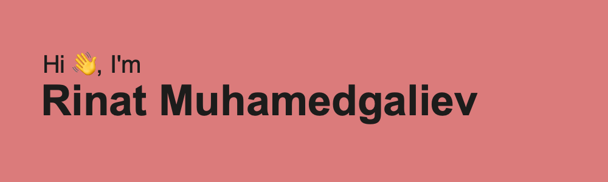

I'm software engineer at Yandex. My hobbies is mentoring, open source projects and study. I like use JVM stack in development. I can work with Java, Python, JS, Swift and other languages.

My skills:

- 🧙‍♂️ mentoring
- 🦾 problem solving
- 🤯 consulting

### 📬 How to reach me

### 💻 Stats

